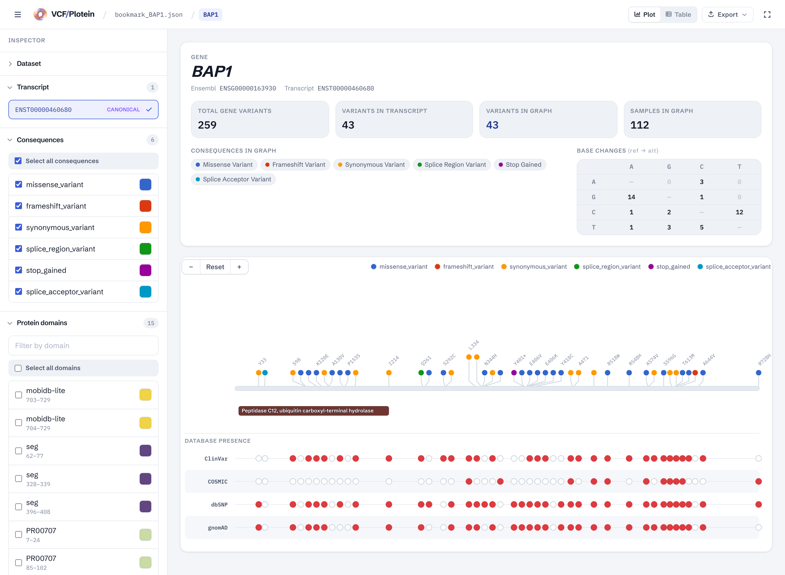
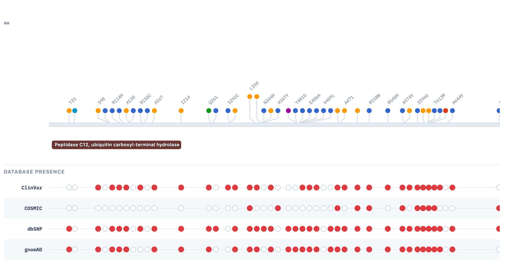

# VCF/Plotein

A **Vue 3** web application for the clinical interpretation of genetic variants from exome sequencing VCF files. It maps raw genomic variants onto protein structures so clinicians and researchers can visually assess pathogenicity, functional impact, and clinical relevance.

[](#license)
[](https://academic.oup.com/bioinformatics/article/35/22/4803/5510555)
[](https://doi.org/10.1093/bioinformatics/btz458)
[](https://vuejs.org/)
[](https://vite.dev/)
[](https://tailwindcss.com/)
[](https://d3js.org/)

**[Live demo](https://vcfplotein-production.up.railway.app)** &nbsp;·&nbsp; **[Published in Bioinformatics (2019)](https://academic.oup.com/bioinformatics/article/35/22/4803/5510555)** &nbsp;·&nbsp; **[Open-access full text (PMC)](https://pmc.ncbi.nlm.nih.gov/articles/PMC6853650/)** &nbsp;·&nbsp; **[Original instance (LIIGH-UNAM)](http://vcfplotein.liigh.unam.mx)**



## Published research

VCF/Plotein is a peer-reviewed clinical genomics tool I helped build at the **Cancer Genetics & Bioinformatics Lab, LIIGH-UNAM** (Laboratorio Internacional de Investigación sobre el Genoma Humano, Universidad Nacional Autónoma de México), Querétaro, Mexico. It was published in *Bioinformatics* (Oxford University Press) in 2019 as part of a collaborative lab project.

> Ossio, R., Garcia-Salinas, O.I., **Anaya-Mancilla, D.S.**, Garcia-Sotelo, J.S., Aguilar, L.A., Adams, D.J., Robles-Espinoza, C.D. (2019). **VCF/Plotein: visualization and prioritization of genomic variants from human exome sequencing projects.** *Bioinformatics*, 35(22), 4803–4805. Oxford University Press. DOI: [10.1093/bioinformatics/btz458](https://doi.org/10.1093/bioinformatics/btz458)

## About this branch — 2026 modernization

The original tool was built in 2018–2019 on **Nuxt 2 / Vue 2 / Webpack / node-sass / Bootstrap-Vue** — a toolchain that no longer installs or builds on a current Node.js. This `modernized` branch brings the codebase up to a present-day front-end stack while preserving the application's behavior and look:

- **Nuxt 2 / Vue 2 → Vue 3 + Vite 5** — Composition API with `<script setup>`; dev server cold-start ~0.2s.
- **Vuex → Pinia**, **Nuxt file-routing → Vue Router 4**.
- **node-sass → Tailwind CSS v4** — the UI chrome rebuilt with Tailwind; native Sass compilation removed.
- **Bootstrap-Vue → hand-rolled Tailwind components** (data table, pagination, file input).
- **D3 v5 → D3 v7** — including the v6 event-handler API change across the lollipop renderer.
- **Expired-certificate proxy** for the companion backend — see [Architecture highlights](#architecture-highlights).

## Why VCF matters

The Variant Call Format (VCF) is the standard file for storing DNA sequence variations—SNPs, insertions, deletions, and structural variants—generated by next-generation sequencing. A single exome can yield tens of thousands of variants. Identifying the handful that are clinically actionable requires integrating genomic coordinates with gene annotations, protein domains, population frequencies, and pathogenicity predictions. This tool automates that pipeline in the browser.

## What this app does

1. **Upload & parse** — Accepts `.vcf`, `.vcf.gz`, or saved `.json` bookmarks directly in the browser.
2. **Gene extraction** — Uses the reference genome (GRCh37/hg19 or GRCh38) to map variant positions to coding genes.
3. **Annotation** — Queries the Ensembl VEP REST API to annotate consequences, amino-acid changes, protein domains, and transcript structures.
4. **Clinical cross-referencing** — Checks variant presence in ClinVar, COSMIC, dbSNP, and gnomAD via a companion API.
5. **Pathogenicity scoring** — Displays SIFT and PolyPhen predictions for missense variants.
6. **Protein visualization** — Renders interactive D3.js lollipop plots showing variants mapped onto protein domains.
7. **Filtering & exploration** — Filter by consequence type, protein domain, sample, and database presence; toggle between plot and tabular views.
8. **Export & bookmarks** — Save sessions as JSON bookmarks, export tables as CSV, and download plots as SVG or PNG.

## Tech stack

- **Framework:** Vue 3 (Composition API, `<script setup>`)
- **Build tool:** Vite 5
- **State & routing:** Pinia, Vue Router 4
- **Styling:** Tailwind CSS v4
- **Visualization:** D3.js v7 (lollipop plots, protein domains, database tracks)
- **Production server:** zero-dependency Node.js server (`server/index.js`) — static host + API proxy
- **Genomics utilities:** `pako` (gzip), `@gmod/bgzf-filehandle`, an interval-tree gene mapper

## Architecture highlights

- **Raw genomic data never leaves the browser.** VCF and gzipped `.vcf.gz` files are decompressed and parsed entirely client-side with `pako` — a deliberate privacy choice, since exome data is PHI and clinical labs should not have to upload it to a third party.
- **Companion-backend proxy.** The variant-database lookups (ClinVar/COSMIC/dbSNP/gnomAD) are served by a backend at LIIGH-UNAM whose TLS certificate has expired, which browsers refuse to call directly. The app instead requests a relative `/api/*` path; both the Vite dev server and the production Node server (`server/index.js`) reverse-proxy those calls to the upstream, transparently bypassing the expired certificate. The browser only ever talks to a valid-certificate origin.
- **Lazy-loaded gene reference data.** The GRCh37/38 gene coordinate tables (~13 MB) are code-split into a separate chunk that loads only when a raw VCF actually needs gene mapping — keeping the initial bundle around 370 KB.
- **Interval-tree gene mapping.** Variant positions are matched to coding genes via a lazily-built interval tree, with a priority queue assisting coordinate partitioning — fast per-variant lookups across exomes with tens of thousands of variants.
- **D3 v7 lollipop rendering.** Variants are drawn along the protein sequence and overlaid on annotated protein domains, with keyboard navigation, hover tooltips, and SVG/PNG export.

## Running locally

```bash
npm install

npm run dev      # Vite dev server with hot reload at localhost:3000
npm run build    # production build → dist/
npm start        # serve dist/ + proxy /api → node server/index.js
npm run lint     # ESLint
```

No special toolchain is required — the project builds on current Node.js. In development, the Vite dev server proxies `/api/*` to the LIIGH-UNAM companion backend automatically; the Ensembl REST API is called directly.

## Deployment

Live on Railway at **[vcfplotein-production.up.railway.app](https://vcfplotein-production.up.railway.app)**. The production artifact is the `dist/` build served by `server/index.js` — a zero-dependency Node server that serves the SPA and reverse-proxies `/api/*` to the companion backend (transparently bypassing the upstream's expired TLS certificate). Any Node host works:

- **Build command:** `npm run build`
- **Start command:** `npm start`

The server reads `PORT` from the environment.

## Sample data

`public/bap1-sample.vcf` is a small BAP1 variant set for trying the upload flow. The built-in **Demo** button loads a pre-computed BAP1 dataset with no file needed.

## Screenshots

The BAP1 demo dataset rendered as an interactive D3.js lollipop plot — variants mapped onto the protein's domains, with ClinVar / COSMIC / dbSNP / gnomAD presence tracks:




## Why this project matters

Precision medicine depends on turning raw sequencing data into interpretable insights. By visualizing how exome variants map to protein structure and combining them with clinical and pathogenicity databases, this tool reduces the manual burden on molecular biologists and supports faster, more informed clinical decisions.

## Author & contributions

VCF/Plotein was a collaborative project of the **Cancer Genetics & Bioinformatics Lab at LIIGH-UNAM**. **Diego Said Anaya-Mancilla** contributed as one of the developers of the tool, working on the web application within the lab team. The original project was a team effort that resulted in the 2019 *Bioinformatics* publication; credit for the tool belongs to the lab and its contributors collectively, not to any single author. The 2026 modernization to a Vue 3 / Vite stack (this `modernized` branch) is later, independent work on the codebase.

## License

Released under the [MIT License](LICENSE.txt). Copyright 2018 Carla Daniela Robles Espinoza (LIIGH-UNAM).
