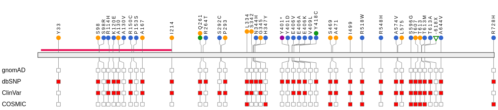

# VCF/Plotein

A Nuxt.js web application for the clinical interpretation of genetic variants from exome sequencing VCF files. It maps raw genomic variants onto protein structures so clinicians and researchers can visually assess pathogenicity, functional impact, and clinical relevance.

[](#license)
[](https://academic.oup.com/bioinformatics/article/35/22/4803/5510555)
[](https://doi.org/10.1093/bioinformatics/btz458)
[](https://v2.nuxt.com/)
[](https://v2.vuejs.org/)
[](https://d3js.org/)

**[Live demo](http://vcfplotein.liigh.unam.mx)** (hosted by LIIGH-UNAM) &nbsp;·&nbsp; **[Published in Bioinformatics (2019)](https://academic.oup.com/bioinformatics/article/35/22/4803/5510555)** &nbsp;·&nbsp; **[Open-access full text (PMC)](https://pmc.ncbi.nlm.nih.gov/articles/PMC6853650/)**


## Published research

VCF/Plotein is a peer-reviewed clinical genomics tool I helped build at the **Cancer Genetics & Bioinformatics Lab, LIIGH-UNAM** (Laboratorio Internacional de Investigación sobre el Genoma Humano, Universidad Nacional Autónoma de México), Querétaro, Mexico. It was published in *Bioinformatics* (Oxford University Press) in 2019 as part of a collaborative lab project. The work below is the result of a multi-developer team effort within the lab.

> Ossio, R., Garcia-Salinas, O.I., **Anaya-Mancilla, D.S.**, Garcia-Sotelo, J.S., Aguilar, L.A., Adams, D.J., Robles-Espinoza, C.D. (2019). **VCF/Plotein: visualization and prioritization of genomic variants from human exome sequencing projects.** *Bioinformatics*, 35(22), 4803–4805. Oxford University Press. DOI: [10.1093/bioinformatics/btz458](https://doi.org/10.1093/bioinformatics/btz458)

## Why VCF matters

The Variant Call Format (VCF) is the standard file for storing DNA sequence variations—SNPs, insertions, deletions, and structural variants—generated by next-generation sequencing. A single exome can yield tens of thousands of variants. Identifying the handful that are clinically actionable requires integrating genomic coordinates with gene annotations, protein domains, population frequencies, and pathogenicity predictions. This tool automates that pipeline in the browser.

## What this app does

1. **Upload & parse** — Accepts `.vcf`, `.vcf.gz`, or saved `.json` bookmarks directly in the browser.
2. **Gene extraction** — Uses the reference genome (GRCh37/hg19 or GRCh38) to map variant positions to coding genes.
3. **Annotation** — Queries the Ensembl VEP REST API to annotate consequences, amino-acid changes, protein domains, and transcript structures.
4. **Clinical cross-referencing** — Checks variant presence in ClinVar, COSMIC, dbSNP, and gnomAD via a companion API.
5. **Pathogenicity scoring** — Displays SIFT and PolyPhen predictions for missense variants.
6. **Protein visualization** — Renders interactive D3.js lollipop plots showing variants mapped onto protein domains.
7. **Filtering & exploration** — Filter by consequence type, protein domain, sample, and database presence; toggle between plot and tabular views.
8. **Export & bookmarks** — Save sessions as JSON bookmarks, export tables as CSV, and download plots as SVG or PNG.

## Tech stack

- **Framework:** Nuxt.js 2 (Vue 2, Vuex, client-side routing)
- **UI:** Bootstrap-Vue, SCSS, FontAwesome
- **Visualization:** D3.js v5 (lollipop plots, protein domains, interactive tips)
- **Build & serve:** Node.js, Express, `serve.js` for production
- **Utilities:** `html2canvas`, `save-svg-as-png`, `file-saver`, `json2csv`, `pako` (gzip)

## Key features

- In-browser VCF/VCF.gz parsing (no server upload required for raw data)
- Automatic reference genome detection (GRCh37/GRCh38)
- Interactive protein lollipop chart with zoom and domain highlighting
- Per-variant clinical metadata: ClinVar significance, COSMIC, dbSNP, gnomAD
- Functional impact: SIFT and PolyPhen scores
- Sample-level filtering for multi-sample VCFs
- Bookmarking system to save and reload analysis sessions
- Demo mode with pre-loaded BAP1 data
- Guided UI tour and responsive layout

## Technical highlights & decisions

- **Raw genomic data never leaves the browser.** VCF and gzipped `.vcf.gz` files are decompressed and parsed entirely client-side with `pako` — a deliberate privacy choice, since exome data is PHI and clinical labs should not have to upload it to a third party.
- **Interval-tree gene mapping.** Variant positions are matched to coding genes by inserting all GRCh37/GRCh38 genes into a lazily-built interval tree and querying by point, with a priority queue assisting coordinate partitioning (`utilities/GeneTree.js`, `utilities/intervalPartition.js`). This keeps per-variant lookups fast across exomes with tens of thousands of variants.
- **D3.js v5 lollipop rendering.** Variants are drawn as interactive lollipops positioned along the protein sequence and overlaid on annotated protein domains, with zoom, tooltips, and SVG/PNG export.
- **Hash-mode routing for static institutional hosting.** The router runs in `hash` mode (`nuxt.config.js`) so the app can be served as static files from UNAM infrastructure without server-side rewrite rules.
- **Node heap tuning for large exomes.** The production server is launched with `--max-old-space-size=3072` to handle the memory footprint of large variant sets and the in-memory gene reference data.
- **API URL injected at build time.** The companion annotation backend endpoint is provided via the `URL_API` environment variable, allowing the same build to target local or institutional backends.

## Running locally

> **Toolchain caveat — read first.** This project was built in 2018–2019 for the Node 10–12 era. It depends on `node-sass@4.x` and Nuxt 2.4, which do **not** install or build cleanly on modern Node (24+) without a legacy toolchain or container (e.g. Node 12 via `nvm`, or a Docker image pinned to that era). The live demo and its companion annotation backend are institutionally hosted at LIIGH-UNAM, so running locally is only needed for development on the original toolchain.

```bash
# Install dependencies (requires Node 10–12 era toolchain)
npm install

# Development server with hot reload at localhost:3000
npm run dev

# Production build & serve
npm run build
npm start

# Or use the Express wrapper (heap-tuned for large exomes)
npm run serve

# Static generation
npm run generate
```

> **Note:** The app queries the Ensembl REST API and a companion backend for annotations. Some features require network access.

## Screenshots

The BAP1 demo dataset rendered as an interactive D3.js lollipop plot — the tool's marquee output, showing variants mapped onto the protein's domains:



VCF/Plotein application branding:


> A full interactive walkthrough is available on the **[live demo](http://vcfplotein.liigh.unam.mx)**. Note: the demo is hosted by UNAM and its HTTPS certificate may trigger a browser warning — this is expected and not a sign of a compromised site.

## Why this project matters

Precision medicine depends on turning raw sequencing data into interpretable insights. By visualizing how exome variants map to protein structure and combining them with clinical and pathogenicity databases, this tool reduces the manual burden on molecular biologists and supports faster, more informed clinical decisions.

## Author & contributions

VCF/Plotein was a collaborative project of the **Cancer Genetics & Bioinformatics Lab at LIIGH-UNAM**. **Diego Said Anaya-Mancilla** contributed as one of the developers of the tool, working on the web application within the lab team. The project was a team effort that resulted in the 2019 *Bioinformatics* publication; credit for the tool belongs to the lab and its contributors collectively, not to any single author.

## License

Released under the [MIT License](LICENSE.txt). Copyright 2018 Carla Daniela Robles Espinoza (LIIGH-UNAM).
